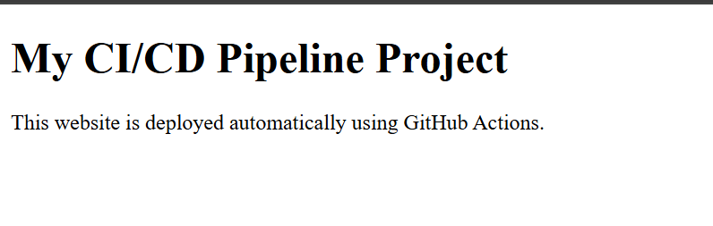
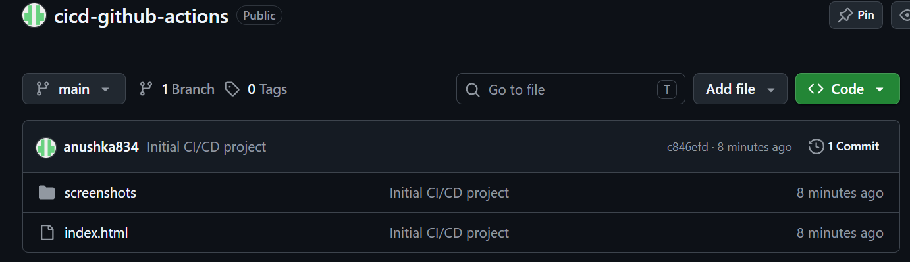
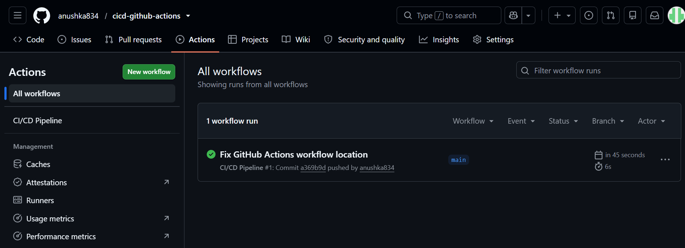
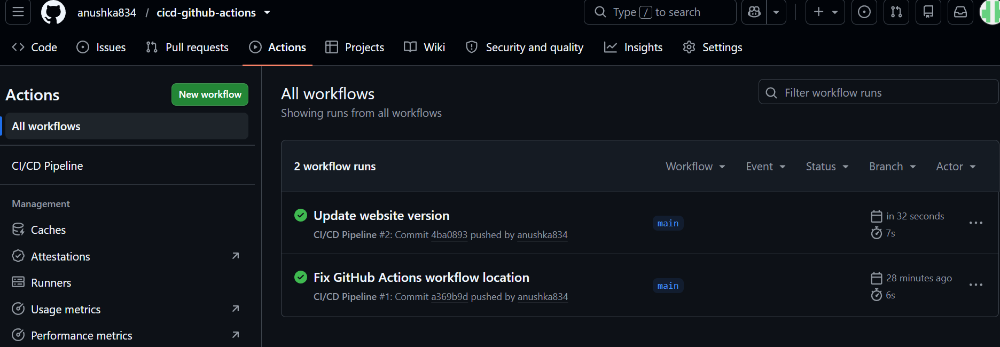

# CI/CD Pipeline using GitHub Actions

## Project Overview

A simple CI/CD project that uses GitHub Actions to automatically run a deployment workflow whenever changes are pushed to the main branch.

## Objective

The objective of this project is to understand the basic concepts of Continuous Integration and Continuous Deployment (CI/CD) using GitHub Actions.

## Technologies Used

* HTML
* Git
* GitHub
* GitHub Actions
* YAML

## Project Structure

```text
cicd-github-actions
│
├── .github
│   └── workflows
│       └── deploy.yml
│
├── screenshots
│   ├── 01_cicd_website.png
│   ├── 02_github_repository.png
│   ├── 03_cicd_pipeline_success.png
│   └── 04_automatic_cicd_run.png
│
├── index.html
└── README.md
```

## GitHub Actions Workflow

The workflow is stored in:

```text
.github/workflows/deploy.yml
```

The workflow is triggered whenever code is pushed to the `main` branch.

## CI/CD Process

```text
Developer makes changes
        ↓
     Git commit
        ↓
      Git push
        ↓
   GitHub Repository
        ↓
   GitHub Actions
        ↓
   Workflow executes
        ↓
   Deployment completed
```

## Workflow Steps

1. Code is pushed to the GitHub repository.
2. GitHub Actions automatically starts the workflow.
3. The repository code is checked out.
4. The deployment step is executed.
5. The workflow completes successfully.

## Testing

The workflow was tested by updating the website and pushing the changes to the `main` branch.

A second GitHub Actions workflow run was automatically triggered and completed successfully.

## Screenshots

### 1. CI/CD Website



### 2. GitHub Repository



### 3. CI/CD Pipeline Success



### 4. Automatic CI/CD Run



## Project Outcome

Successfully created and tested a basic CI/CD pipeline using GitHub Actions. The workflow automatically executes when changes are pushed to the main branch.
